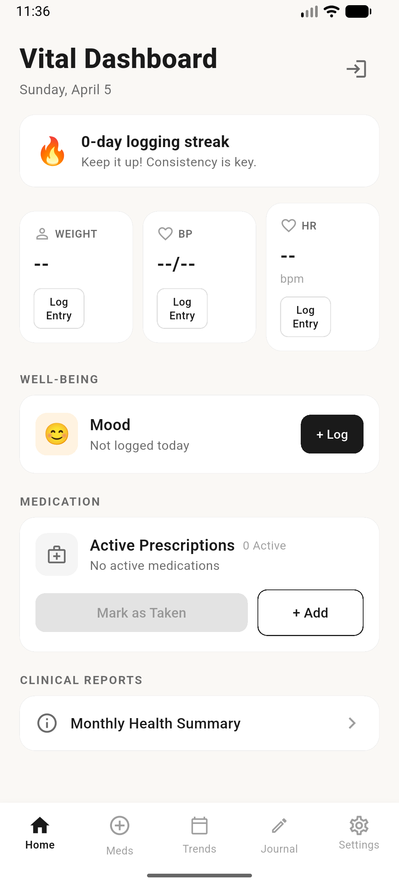
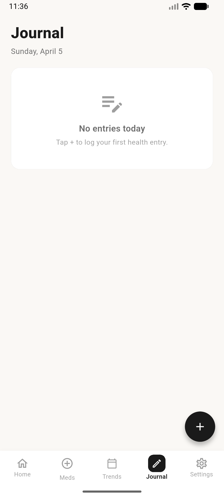
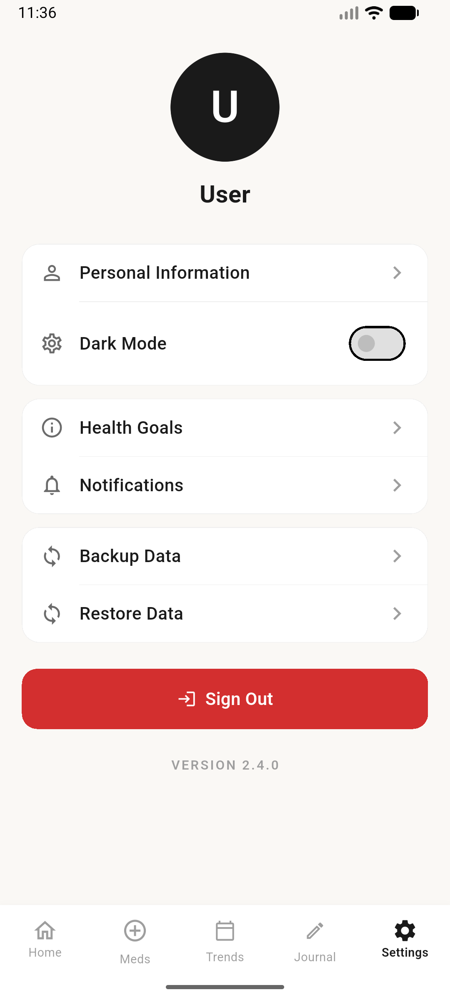

<div align="center">

# Vital Health Application

**A lightweight health tracking system built with Flutter**

[](https://dart.dev)
[](https://flutter.dev)
[](LICENSE)

</div>

---

## Overview

This application provides a streamlined interface for tracking critical health metrics. It is designed for maximum simplicity and operates with minimal infrastructure overhead, utilizing Google Apps Script and Google Sheets for data management.

## Screenshots

| Main Interface | Data Entry | Settings |
| :---: | :---: | :---: |
|  |  |  |

---

## Features

### Health Tracking

| Feature | Description |
| :--- | :--- |
| **Weight Logging** | Record daily weight measurements in kilograms with timestamped entries. |
| **Blood Pressure** | Log systolic and diastolic pressure levels through a structured interface. |
| **Combined Actions** | Simultaneously record weight and blood pressure for improved efficiency. |

### System Characteristics

| Characteristic | Description |
| :--- | :--- |
| **Minimalist UI** | A home screen designed with exactly three primary actions to reduce cognitive load. |
| **Serverless Integration** | Direct communication with Google Apps Script to eliminate dedicated server maintenance. |
| **Transparent Storage** | Data is persisted in a Google Sheets spreadsheet for immediate user accessibility. |
| **Configuration Persistence** | Local storage of user preferences and backend endpoints via Shared Preferences. |

---

## Tech Stack

| Layer | Technology |
| :--- | :--- |
| **Language** | Dart 3.x |
| **Framework** | Flutter (Material 3) |
| **State Management** | Provider |
| **HTTP Client** | http package |
| **Configuration** | shared_preferences |
| **Architecture** | Google Apps Script (Web App) |
| **Storage** | Google Sheets |

---

## Architecture

The application focuses on a direct communication model between the mobile client and the logic layer.

- **Presentation Layer**: Implements a simplified user interface centered on three core logging activities.
- **Provider Layer**: Manages configuration state and facilitates asynchronous data transmission.
- **Logic Layer (Google Apps Script)**: Receives encrypted payloads and executes the write operations to the spreadsheet.
- **Data Layer**: Utilizes Google Sheets as the primary persistence mechanism.

```text
lib/
├── core/                  # Application theme and constants
├── data/
│   ├── api_client.dart    # Apps Script communication logic
│   └── models.dart        # Weight and Blood Pressure data structures
├── presentation/
│   ├── providers/         # Configuration and Health data providers
│   └── screens/           # Home, Onboarding, and Settings screens
└── main.dart              # Application entry point
```

---

## Getting Started

### Prerequisites

- Flutter SDK 3.x
- Google Account for spreadsheet hosting

### Configuration

1.  **Backend Setup**: Deploy the `google_apps_script.js` file found in the root directory as a Google Apps Script Web App.
2.  **App Setup**: Launch the application and enter your name and the Web App URL during the onboarding process.
3.  **Permissions**: Ensure the Web App deployment is configured to allow access to the target spreadsheet.

### Build and Run

```bash
flutter pub get
flutter run
```

---

## Design Principles

- **Typography**: Utilizes the Material 3 type scale with Inter and Playfair Display for clear readability.
- **Visual Style**: A professional light and dark mode palette that avoids high-contrast fatigue.
- **Simplicity**: Every interaction is designed to get the user to the log completion screen in the fewest steps possible.

---

## License

This project is licensed under the **GNU General Public License v3.0** — see the [LICENSE](LICENSE) file for details.
